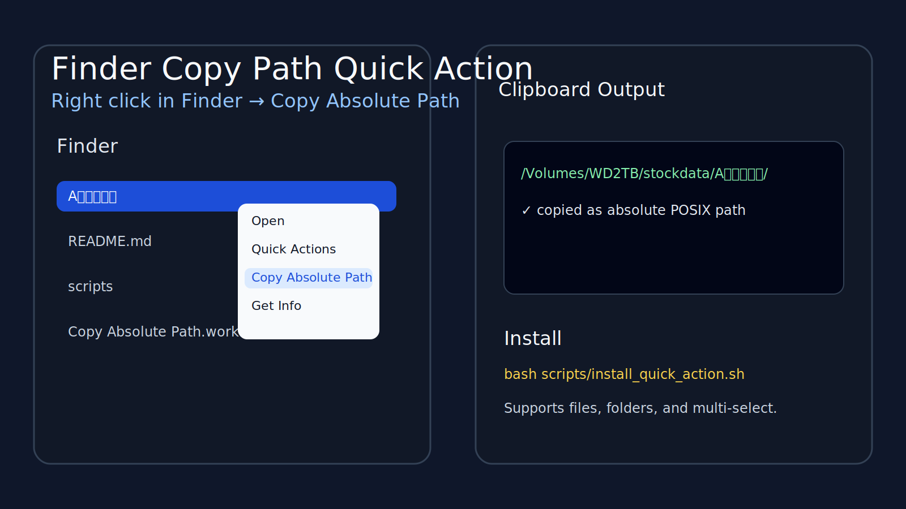

# Finder Copy Path Quick Action

[中文](#中文说明) | [English](#english)

---

## English

A tiny macOS Finder Quick Action that lets you right-click any selected file or folder and copy its absolute path to the clipboard.



### Features
- Works in Finder right-click menu
- Supports files and folders
- Supports multi-select
- Copies POSIX absolute paths to clipboard
- Uses native AppleScript clipboard handling for better reliability

### Install

#### Option 1: One-command install
```bash
git clone https://github.com/fufuandfoufou/finder-copy-path-quick-action.git
cd finder-copy-path-quick-action
bash scripts/install_quick_action.sh
```

#### Option 2: Download ZIP
1. Download this repository as ZIP
2. Extract it
3. Open Terminal in the extracted folder
4. Run:
```bash
bash scripts/install_quick_action.sh
```

### Usage
1. Open Finder
2. Select one or more files/folders
3. Right click
4. Choose **Quick Actions** or **Services** → **Copy Absolute Path**
5. Paste anywhere

If multiple items are selected, paths are copied as multiple lines.

### Notes
- If the action does not appear immediately, restart Finder or log out and back in.
- On some systems, the menu may appear under **Quick Actions**; on others, under **Services**.
- Notification display may depend on macOS notification permissions.

### Uninstall
```bash
rm -rf ~/Library/Services/"Copy Absolute Path".workflow
```

### How it works
This project installs a Finder Quick Action workflow into:

```bash
~/Library/Services/Copy Absolute Path.workflow
```

The workflow uses AppleScript to:
- receive selected Finder items
- convert them to POSIX absolute paths
- join them with line breaks
- write the result to the clipboard

### License
MIT

---

## 中文说明

这是一个很小的 macOS Finder 快速操作（Quick Action）工具。安装后，你可以在 Finder 里选中文件或文件夹，右键后直接把它们的**绝对路径**复制到剪贴板。


### 功能
- 集成到 Finder 右键菜单
- 支持文件和文件夹
- 支持多选
- 复制 POSIX 格式绝对路径
- 使用 AppleScript 原生剪贴板，兼容性更稳

### 安装方法

#### 方式一：命令行安装
```bash
git clone https://github.com/fufuandfoufou/finder-copy-path-quick-action.git
cd finder-copy-path-quick-action
bash scripts/install_quick_action.sh
```

#### 方式二：下载 ZIP 安装
1. 下载本仓库 ZIP
2. 解压
3. 在解压目录打开终端
4. 执行：
```bash
bash scripts/install_quick_action.sh
```

### 使用方法
1. 打开 Finder
2. 选中一个或多个文件 / 文件夹
3. 右键
4. 点击 **快速操作** 或 **服务** → **Copy Absolute Path**
5. 在任意地方粘贴

如果你一次选中多个项目，会按**每行一个路径**复制到剪贴板。

### 说明
- 如果安装后右键菜单没有立刻出现，可以重启 Finder，或者注销后重新登录。
- 不同 macOS 版本里，它可能出现在 **快速操作** 或 **服务** 菜单下。
- 是否弹系统通知，取决于你的 macOS 通知权限设置。

### 卸载方法
```bash
rm -rf ~/Library/Services/"Copy Absolute Path".workflow
```

### 原理
这个项目会在系统里安装一个 Finder Quick Action，位置是：

```bash
~/Library/Services/Copy Absolute Path.workflow
```

它会用 AppleScript：
- 接收 Finder 当前选中项
- 转成 POSIX 绝对路径
- 多个路径按换行拼接
- 写入系统剪贴板

### License
MIT
